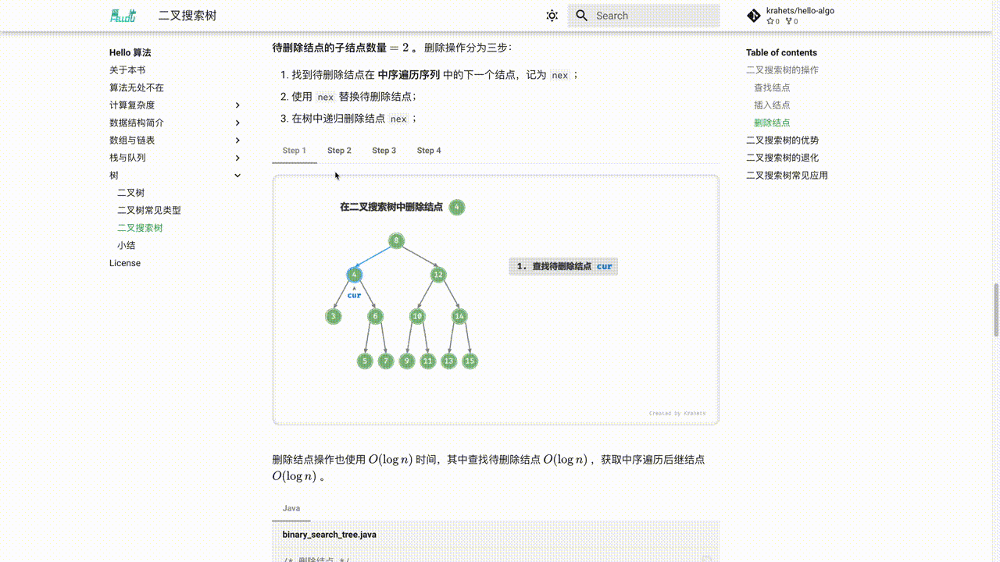
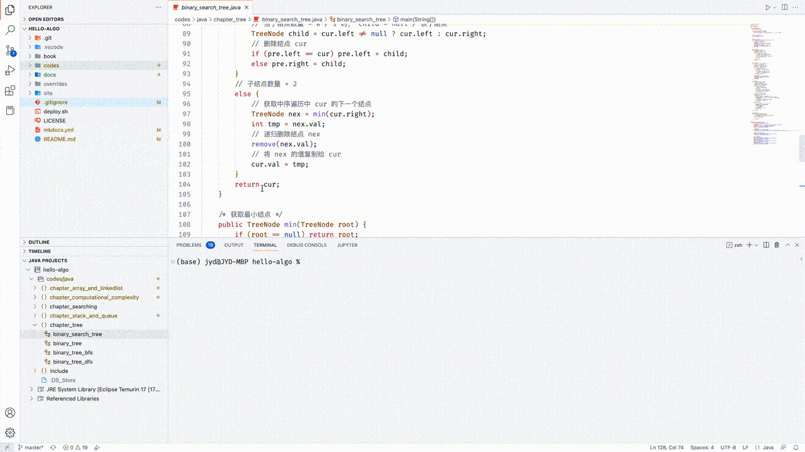
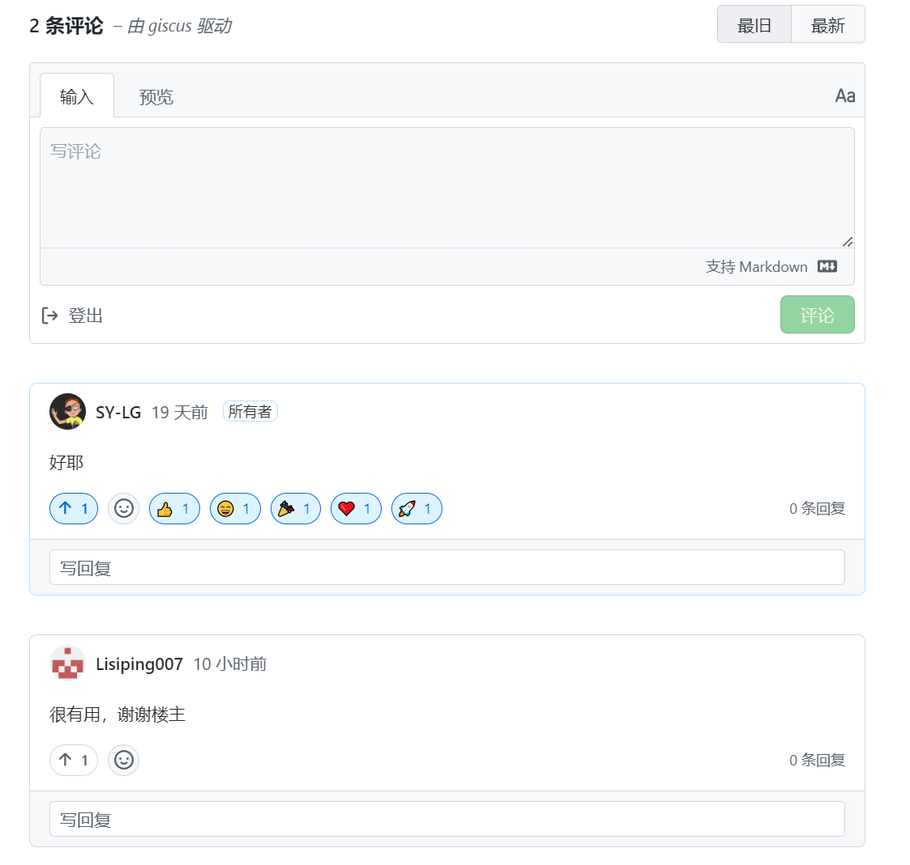

# 如何使用本教培系统

建议通读本节内容，以获取最佳阅读体验。

## 总体学习路线

总体上看，我认为可将学习探索研究Robocup小型组的过程分为三个阶段。

1. **入门**。熟悉了解SSL和它的技术框架，学习各种算法和硬件的原理、用途等。
2. **小处切入**。可以先从简单的任务入手，熟悉大多数的代码逻辑或硬件知识。刚开始时，“遗忘”是最大的困扰点，但这是很正常的，请不要担心。学习中有一种概念叫“周期性回顾”，类似的错误，在遭遇 3 轮以上后，往往就能不再烦恼了。
3. **搭建知识体系**。在完成任务的过程中逐渐接触Robocup小型组系统的其他部分，不断增进对其的了解并继续扩展，最终形成完整的RoboCup知识技术体系。

作为一个入门教培系统，**本教培系统内容主要对应“第一阶段”**，致力于帮助你更高效地开展第二、三阶段的学习探索研究。

## 行文风格约定

重要名词会用 `「括号」` 标注，例如 `「SSL」` 。建议记住这些名词，包括英文翻译，以便后续阅读文献时使用。

重点内容、总起句、总结句会被 **加粗** ，此类文字值得特别关注。

专有名词和有特指含义的词句会使用 `“双引号”` 标注，以避免歧义。

本教培系统部分放弃了编程语言的注释规范，以换取更加紧凑的内容排版。注释主要分为三种类型：标题注释、内容注释、多行注释。

=== "C++"

    ```cpp title=""
    /* 标题注释，用于标注函数、类、测试样例等 */
    
    // 内容注释，用于详解代码
    
    /**
     * 多行
     * 注释
     */
    ```

=== "Python"

    ```python title=""
    """ 标题注释，用于标注函数、类、测试样例等 """
    
    # 内容注释，用于详解代码
    
    """
    多行
    注释
    """
    ```

=== "TypeScript"

    ```typescript title=""
    /* 标题注释，用于标注函数、类、测试样例等 */
    
    // 内容注释，用于详解代码
    
    /**
     * 多行
     * 注释
     */
    ```

=== "C"

    ```c title=""
    /* 标题注释，用于标注函数、类、测试样例等 */
    
    // 内容注释，用于详解代码
    
    /**
     * 多行
     * 注释
     */
    ```

## 在动画图解中高效学习

视频和图片相比于文字的信息密度和结构化程度更高，更容易理解。在本教培系统中，**知识重难点会主要以动画、图解的形式呈现**，而文字的作用则是作为动画和图的解释与补充。

使用本教培系统时，若发现某段内容提供了动画或图解，**建议你以图为主线**，将文字内容（一般在图的上方）对齐到图中内容，综合来理解。



## 在代码实践中加深理解

本教培系统的配套代码托管在[GitHub 仓库](https://github.com/SY-LG/SSL-Wiki)，**源代码包含详细注释，配有测试样例，可以直接运行**。

- 若学习时间紧张，**建议至少将所有代码通读并运行一遍**。
- 若时间允许，**强烈建议对照着代码自己敲一遍**。相比于读代码，写代码的过程往往能带来新的收获。



## 在提问讨论中共同成长

使用本教培系统时，请不要“惯着”那些弄不明白的知识点。**欢迎在评论区留下你的问题**，小伙伴们和我都会给予解答，您一般 2 日内会得到回复。

同时，也希望你可以多花时间逛逛评论区。一方面，可以看看大家遇到了什么问题，反过来查漏补缺，这往往可以引起更加深度的思考。另一方面，也希望你可以慷慨地解答小伙伴们的问题、分享自己的见解，大家互相学习与进步！


