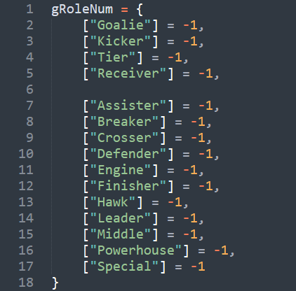
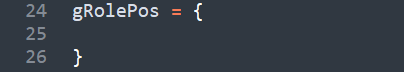
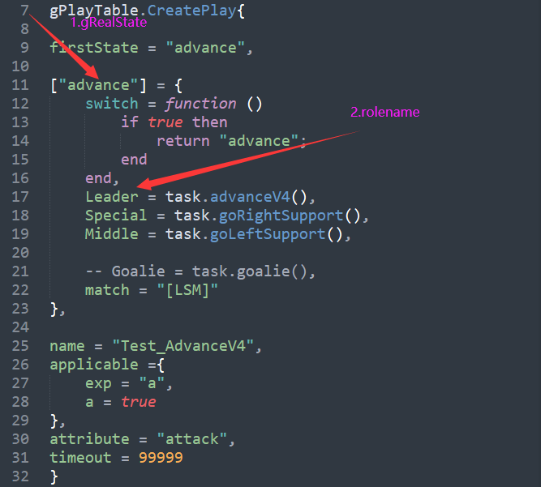
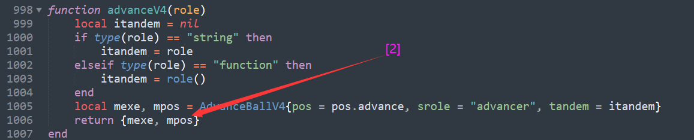
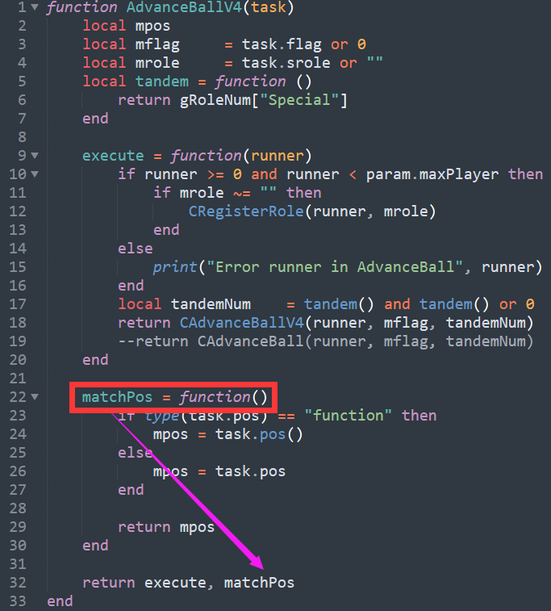

# Play

## 有限状态机

1. 进入一个状态，
   
2. 从World Model中获取信息，判断下一步进入哪个状态

3. 动作分配，

4. 匹配规则

一个例子：

```lua
-- 在实现中，每个状态都是一个Lua的table类型变量，
-- 包括switch，match，Kicker、Goalie（各个角色）这些键
["run1"] = {
    -- 状态的跳转函数
    switch = function ()
        -- 从World Model中获取信息，判断下一步进入哪个状态
        if player.toTargetDist("Kicker") < 20 then
            return "run2"
        end
    end,
    -- 分配任务，调用封装的SKill
    Kicker = task.goCmuRush(TargetPos1, 0),
    -- 匹配规则，这样写就是不匹配
    match = ""
},
```

## RoleMatch

### 相关文件
- bin/lua_scripts/ssl/Config.lua
- bin/lua_scripts/ssl/Play.lua
- bin/lua_scripts/ssl/RoleMatch.lua

### 相关变量和函数

#### bin/lua_scripts/ssl/RoleMatch.lua
| 变量 | 类型 | 含义 | 初始值 |
|:----:|:-----|:---:|:------:|
| gRoleNum | 表 | 表的键是角色字符串；表的值是实车号码（当值为-1时，代表该角色没有分配小车） |  |
| gRolePos | 表 | 表的键是角色字符串；表的值是角色位置点 |  |
| gOurExistNum | 表 | 表的键和值都是实车号码 |  |

#### 相关函数
| 函数 |       输入值       |     输出值     | 作用               | 注意                 |
|:--------------------:|:------------------:|:--------------:| ------------------ | -------------------- |
|  GetMatchPotential   | 小车号码，角色名字 | 两者相近的指标 | 提供角色匹配的依据 | 目前指标是单纯的距离 |

### 运行机制
1. SSLStrategy.cpp
```cpp
decision.DoDecision(false);
```

2. DecisionModule.cpp
```cpp
void CDecisionModule::DoDecision(const bool visualStop)
	GenerateTasks(visualStop);	

void CDecisionModule::GenerateTasks(const bool visualStop)
	DoTeamMode();

void CDecisionModule::DoTeamMode()
	LuaModule::Instance()->RunScript("./lua_scripts/ssl/SelectPlay.lua");
```

3. SelectPlay.lua
```lua
RunPlay(gCurrentPlay)
```

4. Play.lua
```lua
function RunPlay(name)
	DoRolePosMatch(curPlay, false, isStateSwitched)
```

```lua
function DoRolePosMatch(curPlay, isPlaySwitched, isStateSwitched)
	-- Ep: 
	-- gRealState: advance 
	-- rolename: Leader
	-- [2]: MatchPos
	-- ():运行函数
	gRolePos[rolename] = curPlay[gRealState][rolename][2]()
	
	UpdateRole(curPlay[gRealState].match, isPlaySwitched, isStateSwitched)
```







5. RoleMatch.lua
```lua
function UpdateRole(matchTactic, isPlaySwitched, isStateSwitched)
	DoMunkresMatch(role)

function DoMunkresMatch(rolePos)
	local matrix = Matrix_double_:new_local(nrows, ncols)
	-- 这个循环得到每一个实车位置到每一个角色位置的评价指标
	for row = 1, nrows do
		for col = 1, ncols do
			matrix:setValue(row-1, col-1, GetMatchPotential(gOurExistNum[ncolsIndex[col]], rolePos[row]))
		end
	end
	
	-- Munkres算法求解矩阵
	local m = Munkres:new_local()
	m:solve(matrix)
	
	-- 设置角色的车号	
	local eraseList = {}
	for row = 1, nrows do	
		for col = 1, ncols do
			if matrix:getValue(row-1, col-1) == 0 then
				gRoleNum[rolePos[row]] = gOurExistNum[ncolsIndex[col]]
				table.insert(eraseList, gOurExistNum[ncolsIndex[col]])
				break
			end
		end
	end
```